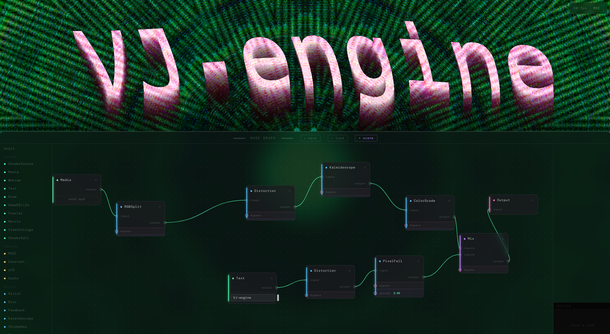

# VJ-engine

### Install
No install needed, just
1) Clone the project
2) Start a local server with `npx serve` or `python -m http.server` or smth else if you prefer
3) Go to your localhost, and then follow the path to this cloned project

### Usage
- Click `space` to toggle the editor view
- Add nodes by selecting them from the left panel
- Click on a node to edit its parameters. Toggling the checkbox turns it into an input, allowing you to connect a controller node (yellow node), such as a MIDI controller or LFO

### Images as it's better to get an idea

### Features (non exhaustive)
 - midi controller
 - audio controller
 - feedback loop
 - code your own shaders (GLSL)
 - import medias
 - all the basic effects
 - save/load/add a scene (json format)